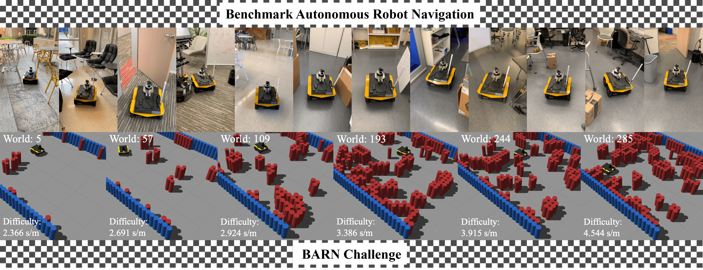

<p align="center">
  
  </p>

--------------------------------------------------------------------------------

# MLDA-EEE ICRA BARN Navigation Challenge 2025
*Please follow README.md at current directory

## Updates:
* 02/04/2024: Adding 60 [DynaBARN](https://github.com/aninair1905/DynaBARN) environments. DynaBARN environments can be accessed by world indexes from 300-359.

## Requirements(For Singularity Only)
If you run it on a local machine without containers:
* ROS version at least Kinetic
* CMake version at least 3.0.2
* Python version at least 3.6
* Python packages: defusedxml, rospkg, netifaces, numpy

If you run it in Singularity containers:
* Go version at least 1.13
* Singularity version at least 3.6.3 and less than 4.02

The requirements above are just suggestions. If you run into any issue, please contact organizers for help (zfxu@utexas.edu).

## Docker Image

This is the docker image for the April 1st Soft-Deadline submission
```
docker pull ccwssplus/ccwss-barn-2025:latest
```
Start the docker container named ``` barn  ```in the background. Use VSCode Dev Container extension to connect to the running container
```
# Allow GUI to be displayed
xhost +

# Nvidia Container
docker run --rm -dt --name barn \
  --gpus all \
  -e DISPLAY="$DISPLAY" \
  -e QT_X11_NO_MITSHM=1 \
  -e LIBGL_ALWAYS_SOFTWARE=1 \
  -e NVIDIA_DRIVER_CAPABILITIES=all \
  -v /tmp/.X11-unix:/tmp/.X11-unix \
  ccwssplus/ros-melodic-env:latest

```

In the docker, the folder structure is similar to the suggested below:
```
# Navigate to this folder in the container
cd /jackal_ws/src//the-barn-challenge/

# standard
python3 run.py --world_idx 0 --gui
```


## Singularity Installation(TBC)

## Run Simulations
Navigate to the folder of this repo. Below is the example to run move_base with DWA as local planner.

If you run it in a Singularity container:
```
./singularity_run.sh /path/to/image/file python3 run.py --world_idx 0
```

A successful run should print the episode status (collided/succeeded/timeout) and the time cost in second:
> \>>>>>>>>>>>>>>>>>> Test finished! <<<<<<<<<<<<<<<<<<
>
> Navigation collided with time 27.2930 (s)

> \>>>>>>>>>>>>>>>>>> Test finished! <<<<<<<<<<<<<<<<<<
>
> Navigation succeeded with time 29.4610 (s)


> \>>>>>>>>>>>>>>>>>> Test finished! <<<<<<<<<<<<<<<<<<
>
>Navigation timeout with time 100.0000 (s)
